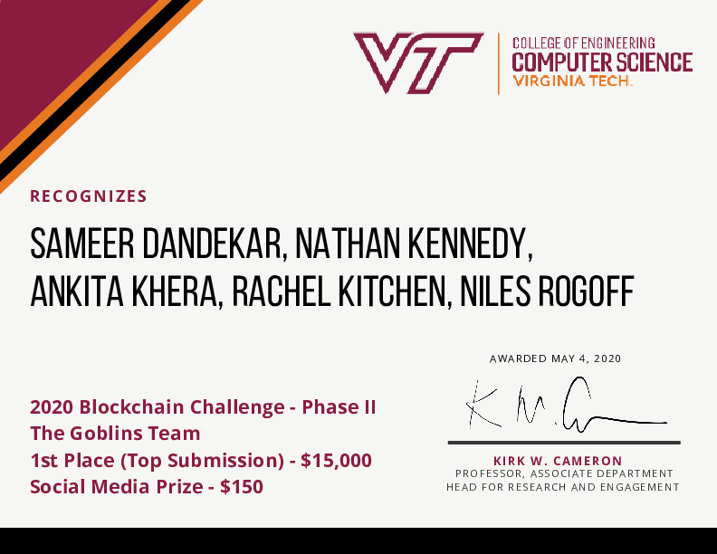

# HokieTickets is an [EOSIO](https://eos.io)-based application for simple and fair student athletic ticket management, winner of the 2020 Virginia Tech Blockchain Challenge.

HokieTickets was a group project created by The Goblins 👺 as part of Virginia Tech's CS4284 Systems and Networking Capstone. 

Our project won first place in both rounds of the 2020 Virginia Tech Blockchain Challenge, and our team won both social media prizes

Pictured: The Goblins (left to right: Rachel Kitchen, Nathan Kennedy, Sammer Dandekar, **Niles Rogoff**, Ankita Khera)

Virginia Tech uses a lottery to distribute tickets to students for football and basketball games. For popular events, tickets sell out and often students resell their ticket for hundreds of dollars beyond market value, unregulated by the university since students can print tickets and send them to others. As an effect, many passionate fans are squeezed out of this experience and not rewarded for their enthusiasm. HokieTickets seeks to create a fairer, more enjoyable blockchain-based system to replace the VT student sports ticket system with a focus on the distribution of tickets and incentivizing participation.  The EOSIO blockchain is used to validate, store, and manage various transactions with tickets, games, and users managed through a smart contract. Using EOSIO to validate transactions ensures the school knows who’s at the game, how many, and that students are rewarded for attending. This system provides a sense of security and trust in the system for both school administrators and students. As a result, students will benefit from a fair distribution system and will enjoy the ticketing and sporting event experience. Virginia Tech will benefit from subduing the ticket black market, allowing the school to fully regulate and profit from the sale of tickets, whether they be sold first-hand or second-hand. The broader community at Virginia Tech will benefit from renewed enthusiasm resulting from incentivizing students who display exemplary school spirit.

HokieTickets prevents scalping and incentivizes student participation at all Virginia Tech sporting events. Using the website or mobile app, students can buy, sell, and auction tickets as well as enter traditional game lotteries. They can also view their account information and transaction history. School administrators can open and execute lotteries and use the mobile app to scan and validate tickets with unique QR codes. The website leverages Mako as a web-server and a templating engine, which the iOS app communicates with via HTTP requests. On the backend, each ticket, game, and user is stored on the EOSIO blockchain and managed through a smart contract. The EOSIO blockchain is used to validate, store, and manage various transactions, which are based around an EOSIO token called a “Hokie Token” with the symbol “HTK”. These transactions and actions on the blockchain include ticket exchanges, lottery winners, and auction winners, and involvement in games with students receiving tokens for attendance. Each user has their own EOSIO account on the blockchain corresponding to their username. The application is stored and hosted on an AWS server. This system secures that transactions of all tickets are visible to Virginia Tech and allows students to be rewarded instantaneously for their attendance, building trust and spirit in the community. 

Here is a brief (90 second) introduction to what HokieTickets can do (click to watch the video)

We also won both social media prizes for our twitter account [@goblinsvt](https://twitter.com/goblinsvt)

You can see our code in the following subdirectories:

|Repository Link| |
|--|--|
|[`www`](https://github.com/nilesr/HokieTickets/tree/master/www)|Web-based Frontend|
|[`libgoblin`](https://github.com/nilesr/HokieTickets/tree/master/libgoblin)|Blockchain Integration Library|
|[`hokipoki`](https://github.com/nilesr/HokieTickets/tree/master/hokipoki)|Blockchain Smart Contract|
|[`football-tickets`](https://github.com/nilesr/HokieTickets/tree/master/football-tickets)|iOS Companion App|

Each project has its own associated readme

The following folders also have related files:

|Subdirectory Link| |
|--|--|
|[`documents/`](https://github.com/nilesr/HokieTickets/tree/master/documents)|Documents including our initial and final proposals, Gannt chart, workflows presentation, and other documents we used to prepare our project and our final submission|
|[`emails/`](https://github.com/nilesr/HokieTickets/tree/master/emails)|Relevant emails|

Small version:

First round certificate:

Older software diagram:

