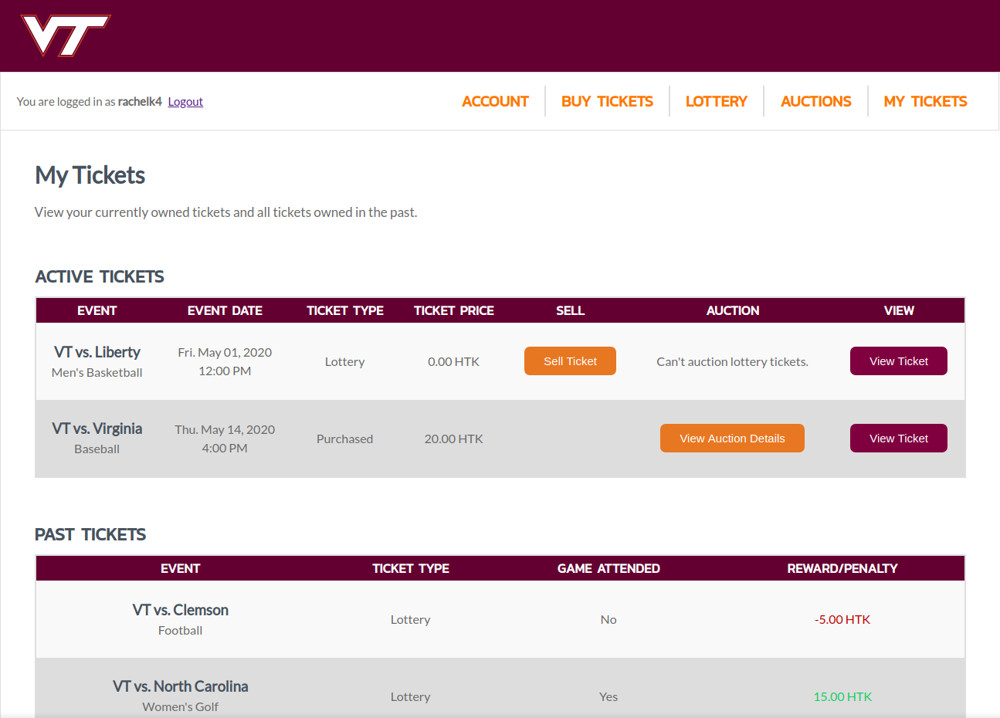

# HokieTickets is an [EOSIO](https://eos.io)-based application for simple and fair student athletic ticket management.

HokieTickets is a blockchain-based web application for managing student athletic tickets and attending games. For code and documentation about the companion iOS app, see the [football-tickets repository](https://github.com/nilesr/HokieTickets/tree/master/football-tickets).

HokieTickets prevents scalping and incentivizes students to attend VT sports events. You can use the app on web or on mobile to complete all actions, including buying/selling tickets, entering the lottery, auctioning, and viewing tickets. The mobile app also allows administrators to scan tickets for entry to games. Smart contracts are used for each of these actions using the [EOSIO](https://eos.io)-based token Hokie Tokens (HTK). Our app gives VT more control over their tickets, and creates a fair system that rewards students who show their school spirit.

The HokieTickets web interface is built on [`Mako`](https://www.makotemplates.org/) templates, a python templating engine that allows inline python code to live with html. All of the templates in this repository end with `.pyhtml`. The files are rendered and served using [`mako-server`](http://github.com/nilesr/mako-server) written by team member Niles back in 2014. Showing unfortunate signs of age, it was written in python 2, and so it can only load Mako templates written in python 2 as well.

The website is broken down into two main interfaces, the student interface and the administrator interface. They are detailed in the sections below, and then some miscellaneous helper files are discussed afterwards.

## Logging In (`login.pyhtml`)

The login page is based on a single form, which POSTs the entered username and password back to the same page on submit. If the username and password sent in the POST request are correct, it redirects the user to either the student account page or the administrator accounts page. The session cookie to stay logged in is called `auth`, and it's discussed in more detail in the [`libgoblin`](https://github.com/nilesr/HokieTickets/tree/master/libgoblin) documentation

`index.pyhtml` is a symbolic link to this page.

## Student Interface

### Account (`student/account.pyhtml`)

Your account page is displayed to you on first login. It contains your 100 most recent transactions on the blockchain. Transactions that you haven't seen before are highlighted in pink.

### Buy Tickets (`student/tickets.pyhtml`)

The Buy Tickets page displays all future games, and provides the option to buy a ticket for that game if you don't have one, or view your ticket if you do.

### Lottery (`student/lottery.pyhtml`)

The Lottery page displays all future games, and provides the option to enter into or leave the lottery for that game if you don't have a ticket for it, or view your ticket if you do.

### Auctions (`student/auctions.pyhtml`)

The Auctions page is split into two tabs. The first displays tickets that you are auctioning off, and tickets that you have bid on. The second lets you find tickets to bid on for a particular game.

### My Tickets (`student/tickets.pyhtml`)

The My Tickets page displays both active and past tickets. Active tickets have a View Ticket button if it's the day of the game, and a sell ticket button if you are not auctioning off the ticket. Active tickets with an auction on them have a button to view the details of the auction, such as highest bid, currently winning bidder, and the option to cancel the auction if nobody has bid on it. Past tickets show you your reward or penalty based on whether you attended.

## Administrator Interface

Administrators have access to the following pages

### Accounts (`admin/accounts.pyhtml`)

The Accounts page displays all accounts on the blockchain that have been registered to use HokieTickets. It displays their balances of hokietokens, as well as their tickets and whether they received them from the lottery or not. It also contains a form for creating new accounts, which generates a new keypair for the new user as well. Details on the steps for creating a new user on the blockchain are documented in the [`libgoblin` repository's User Account Management section](https://github.com/nilesr/HokieTickets/tree/master/libgoblin#user-account-management)

### Transfer (`admin/transfer.pyhtml`)

The Transfer page allows hokietokens to be directly given to any user, for whatever reason.

### Lottery (`admin/lottery.pyhtml`)

The Lottery page allows the administrator to open lotteries for individual games when it becomes time, and also execute the lottery for a game, randomly assigning all lottery tickets to students who entered, and deleting all of the lottery entries for that game.

### Auctions (`admin/auctions.pyhtml`)

The Auctions page allows the administrator to execute any outstanding lotteries on a game. This must be run on the day of the game, to ensure that all auctions are past their end date. This is not necessary for an auction to execute, but it saves people who won an auction, but forgot to ever claim their ticket 

### Attendance (`admin/attendance.pyhtml`)

The Attendance page allows the administrator to mark any ticket has having been used to attend the game, rewarding the user in the process, or penalize all holders of tickets to a game that they did not use. It should only be necessary to mark a ticket as having been used if there is a problem scanning a student's QR code - scanning a student QR code does the exact same thing.

## Other Files

- `logout.pyhtml` - Simply destroys the current session and redirects back to `login.pyhtml`
- `requests.pyhtml` - Used for all AJAX requests from within the app, such as bidding on a ticket, or loading open auctions after clicking on a game. Also used by the mobile app
- `admin/qr.pyhtml` - Used by the mobile app when an administrator scans a QR code. The data in the code is sent to this page, and it validates the qr code, executes the `rewarduser` action, and sends back a json response
- `student/qr.pyhtml` - Used by the mobile app when a student generates a QR code. Given a ticket ID, generates a QR code for the user if they are logged in to the owner of that ticket and it is game day (note - game day checking is not currently enforced for the demo).

- `static/admin.js` - Contains all the javascript for the administrator interface
- `static/student.js` - Contains all the javascript for the student interface
- `static/style.css`

## License

All code in the repository is copyright 2020 Niles Rogoff, Ankita Khera, Nathan Kennedy, Rachel Kitchen, and Sameer Dandekar

